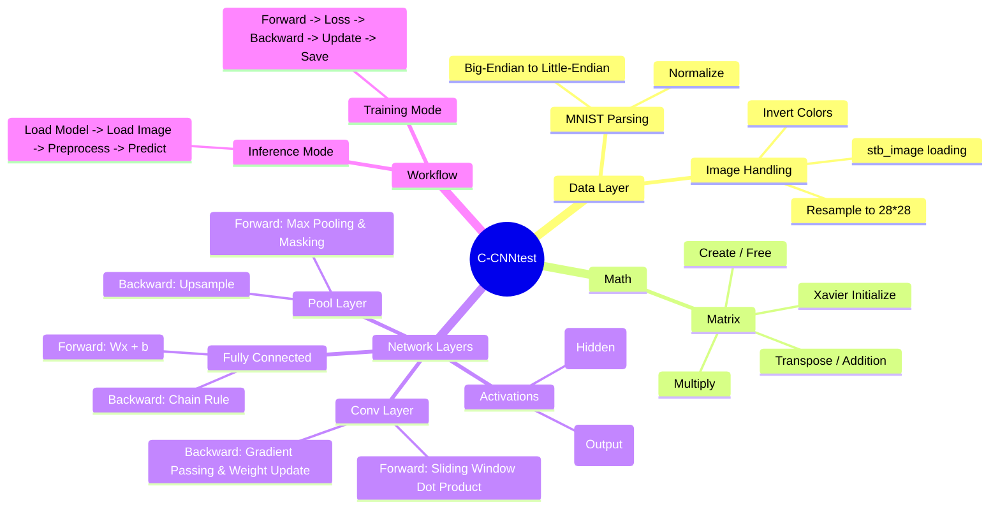

# C-CNNtest

## Implementation
**1. Architecture**

**2. Network Data Flow**

```mermaid
graph LR
    Input["Input Image (28x28)"] --> Conv["Conv Layer (3x3 kernel, 8 filters)"]
    Conv --> |26x26x8| ReLU[ReLU Activation]
    ReLU --> Pool["Max Pooling (2x2)"]
    Pool --> |13x13x8| Flatten[Flatten Operation]
    Flatten --> |1352x1| FC1[Fully Connected Hidden: 128]
    FC1 --> ReLU2[ReLU Activation]
    ReLU2 --> FC2[Fully Connected Output: 10]
    FC2 --> Softmax[Softmax Probability]
    Softmax --> Result[Inference]
```


## Directory Structure

```text
C-CNNtest
│  activations.c                # ReLU, Softmax
│  image_util.c                 # Image load/resize
│  io.c                         # Model save/load
│  layers.c                     # Conv & Pool layer implementations
│  main.c                       # Entry point
│  matrix.c                     # Matrix operations
│  mnist.c                      # MNIST file parser
│  network.c                    # Fully Connected network
│
└─data                          # MNIST dataset files (.ubyte)
        train-images.idx3-ubyte
        train-labels.idx1-ubyte
```

## Getting Started

**Prerequisites**
  - **Compiler**: GCC or Visual Studio (MSVC)
  - **Dataset**: Use what you like or the one included

**Build**

**Option A**:
   1. Open solution file(`.sln`)
   2. Press `Ctrl + F5` to run

**Option B**:
```bash
gcc *.c -I include -o cnntest -lm -O3
./cnntest
```

## Usage

**Mode 1: Train**

Recommended to run for 3 to 5 epochs to achieve >95% acc The model will be saved as `cnn_model.bin`.

**Mode 2: Infer**

Provide a model and any image file.

## Theory

**1. Forward Propagation (向前传播)**

1. **Convolution Layer (卷积层)**
   
   这部分对应 `layers.c/conv_forward`

   假设输入图像为 $\mathbf{X}$ (大小 $H \times W$)，卷积核为 $\mathbf{K}$ (大小 $f \times f$)，偏置为 $b$
   对于第 $k$ 个输出特征图的坐标 $(i, j)$，计算公式为：

   $$\mathbf{Z}^{[1]}_{k, i, j} = \sum_{c=0}^{C_{in}-1} \sum_{u=0}^{f-1} \sum_{v=0}^{f-1} \mathbf{X}_{i+u, j+v, c} \cdot \mathbf{K}_{u, v, c}^{[k]} + b_k$$

   - $\mathbf{X}_{i+u, j+v, c}$: 输入图像在位置 $(i+u, j+v)$ 第 $c$ 个通道的像素值
   - $\mathbf{K}_{u, v, c}^{[k]}$: 第 $k$ 个卷积核的权重

2. **ReLU Activation (激活层)**
   
   这部分对应 `activations.c/apply_relu`

   实现线性整流函数：

   $$
   \mathbf{A}^{[1]}_{k, i, j} = \text{ReLU}(\mathbf{Z}^{[1]}_{k, i, j}) = \max(0, \mathbf{Z}^{[1]}_{k, i, j})
   $$

3. **Max Pooling (池化层)**
   
   这部分对应 `layers.c/pool_forward`

   假设池化窗口大小为 $p \times p$，实现最大池化： 

   $$
   \mathbf{P}^{[1]}_{k, i, j} = \max_{u, v \in \{0, \dots, p-1\}} \left( \mathbf{A}^{[1]}_{k, i \cdot p + u, j \cdot p + v} \right)
   $$

   记录 Mask (最大值索引)：

   $$
   \text{Mask}_{k, i, j} = \arg\max_{u, v} (\dots)
   $$

4. **Flatten (扁平化)**
   
   将多维张量拉伸为一维向量 $\mathbf{v}$，作为全连接层的输入：

   $$
   \mathbf{v} = \text{vec}(\mathbf{P}^{[1]})
   $$

5. **Fully Connected Layer (全连接层)**
   
   **Hidden Layer (隐藏层)**:

   $$\mathbf{z}^{[2]} = \mathbf{W}^{[2]} \mathbf{v} + \mathbf{b}^{[2]}$$

   $$\mathbf{a}^{[2]} = \text{ReLU}(\mathbf{z}^{[2]})$$

   **Output Layer (输出层)**:

   $$\mathbf{z}^{[3]} = \mathbf{W}^{[3]} \mathbf{a}^{[2]} + \mathbf{b}^{[3]}$$

6. **Softmax Output (归一化指数函数输出)**
   
   将输出 logits (原始输出值) 转换为概率分布 $\hat{\mathbf{y}}$：

   $$
   \hat{y}_i = \frac{e^{z^{[3]}_i}}{\sum_{j=1}^{10} e^{z^{[3]}_j}}
   $$

**2. Loss Function (损失函数)**

使用 Cross-Entropy Loss (交叉熵损失)。假设真实标签为 $y$ ([One-hot 编码](https://zhuanlan.zhihu.com/p/634296763))，预测概率为 $\hat{y}$

$$
L = - \sum_{i=1}^{10} y_i \log(\hat{y}_i)
$$

由于 $y$ 是 One-hot (只有正确类别 $t$ 的位置是 $1$，其余是 $0$)，所以简化为：

$$
L = - \log(\hat{y}_t)
$$

**3. Backward Propagation (反向传播)**

利用链式法则计算梯度 $\frac{\partial L}{\partial W}$

1. **Softmax + CrossEntropy (输出层的梯度)**
   
   损失函数 $L$ 对 Softmax 输入 $\mathbf{z}^{[3]}$ 的偏导数是：

   $$
   \delta^{[3]} = \frac{\partial L}{\partial \mathbf{z}^{[3]}} = \hat{\mathbf{y}} - \mathbf{y}
   $$

   即对应：`network.c` 中的 `output->data[i] - target->[i]` (预测概率 - 真实标签)

2. **全连接层的梯度**
   
   利用 $\delta^{[3]}$ 向回推导

   计算 $\mathbf{W}^{[3]}$ 的梯度 (用于更新权重):

   $$
   \frac{\partial L}{\partial \mathbf{W}^{[3]}} = \delta^{[3]} (\mathbf{a}^{[2]})^T
   $$

   计算传递给上一层的误差 $\delta^{[2]}$: 这里需要乘上 ReLU 的导数 $g'(z)$ (即：如果 $z>0$ 为 $1$，否则为 $0$)

   $$
   \delta^{[2]} = (\mathbf{W}^{[3]})^T \delta^{[3]} \odot g'(\mathbf{z}^{[2]})
   $$

   $\odot$ 表示 Hadamard Product (逐元素相乘)

3. **Unflatten (从全连接层传回池化层)**
   
   将一维的误差向量 $\delta^{[input]}$ 重新变形成 3D 张量形状，记为 $\mathbf{d}\mathbf{P}$

4. **Upsampling (池化层的反向传播)**
   
   进行梯度的路由，梯度只流向最大值所在的位置，其余位置为 $0$：

   $$
   \frac{\partial L}{\partial \mathbf{A}^{[1]}_{k, u, v}} = 
    \begin{cases} 
    \mathbf{d}\mathbf{P}_{k, i, j} & \text{if } (u,v) = \text{Mask}_{k, i, j} \\
    0 & \text{otherwise}
    \end{cases}
    $$

5. **卷积层的反向传播**
   
   包含**两**部分：计算权重的梯度，以及计算输入的梯度

   记传入卷积层的误差为 $\delta^{[conv]}$ (即通过了 ReLU 导数后的池化层梯度)

   **A. 计算卷积核梯度** $\frac{\partial L}{\partial \mathbf{K}}$: (Input $\mathbf{X}$ 和 Error $\delta^{[conv]}$ 的卷积)

   $$
   \frac{\partial L}{\partial \mathbf{K}^{[k]}_{u,v,c}} = \sum_{i} \sum_{j} \mathbf{X}_{i+u, j+v, c} \cdot \delta^{[conv]}_{k, i, j}
   $$

   **B. 计算输入梯度 $\frac{\partial L}{\partial \mathbf{X}}$ (全卷积)**: 为了把误差传回输入图（如果你有更多卷积层），我们需要做 Transposed Convolution (转置卷积)，数学上，它是将卷积核旋转 $180$ 度后，与填充后的误差矩阵做卷积

   $$\frac{\partial L}{\partial \mathbf{X}_{i,j,c}} = \sum_{k} \sum_{u} \sum_{v} \delta^{[conv]}_{k, i-u, j-v} \cdot \mathbf{K}^{[k]}_{u, v, c}$$

**3. SGD Optimizer (随机梯度下降参数更新)**

使用 [SGD](https://www.cnblogs.com/lusiqi/p/17258241.html) 更新每一个权重矩阵 $W$ 和偏置 $b$：

$$\mathbf{W} \leftarrow \mathbf{W} - \eta \cdot \frac{\partial L}{\partial \mathbf{W}}$$

$$\mathbf{b} \leftarrow \mathbf{b} - \eta \cdot \frac{\partial L}{\partial \mathbf{b}}$$

- $\eta$: Learning Rate (学习率)